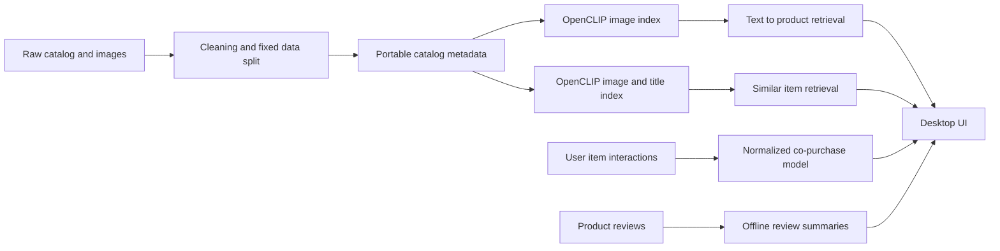

# Architecture

The runtime has four independent responsibilities:



The desktop UI consumes services and generated artifacts. It does not train models or
silently download NLP models. Generated files are tied together by a manifest that
records model identity, vector dimensions, item count, and a metadata checksum.

## Retrieval

Text queries and product images use the same OpenCLIP model. Vectors are L2-normalized
and searched by inner product, so larger values are better. The UI retrieves a larger
candidate set before applying price and category filters.

`IndexFlatIP` remains the exact-search baseline for the current 198k-item catalog.
HNSW or IVF-PQ should only replace it after measuring Recall@K, p50/p95 latency, build
time, and memory on the target machine.

## Similar items

The content index uses a normalized weighted combination of image and title vectors.
It has a separate index from text-to-image search. The ResNet50+BERT classifier is an
offline classification experiment and is not described as the runtime similarity
engine.

## Interaction recommendations

For a source item, candidate products are collected from users who interacted with
that item. The baseline score is normalized co-occurrence:

```text
co_users(source, candidate) / sqrt(users(source) * users(candidate))
```

This reduces pure popularity bias. Ties are deterministic. If interaction coverage is
insufficient, the UI falls back to highly rated products in the same category.
